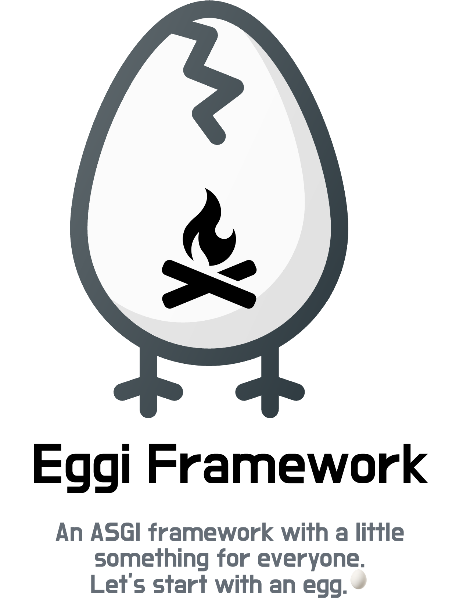

# Eggi Framework

[][pypi_]
[][status]
[][python version]
[][license]

[][tests]
[][codecov]

[][pre-commit]
[][ruff]

[pypi_]: https://pypi.org/project/eggi/
[status]: https://pypi.org/project/eggi/
[python version]: https://pypi.org/project/eggi
[tests]: https://github.com/tgoddessana/eggi/actions?workflow=Tests
[codecov]: https://app.codecov.io/gh/tgoddessana/eggi
[pre-commit]: https://github.com/pre-commit/pre-commit
[ruff]: https://img.shields.io/badge/code%20style-ruff-000000.svg

## Features

- TODO

## Requirements

- Python 3.8+

## Installation

- TODO

## Contributing

- TODO

## License

Distributed under the terms of the [MIT license][license],
_Eggi_ is free and open source software.

## Issues

If you encounter any problems,
please [file an issue] along with a detailed description.

[pypi]: https://pypi.org/
[file an issue]: https://github.com/tgoddessana/eggi/issues
[pip]: https://pip.pypa.io/

<!-- github-only -->

[license]: https://github.com/tgoddessana/eggi/blob/main/LICENSE
[contributor guide]: https://github.com/tgoddessana/eggi/blob/main/CONTRIBUTING.md
